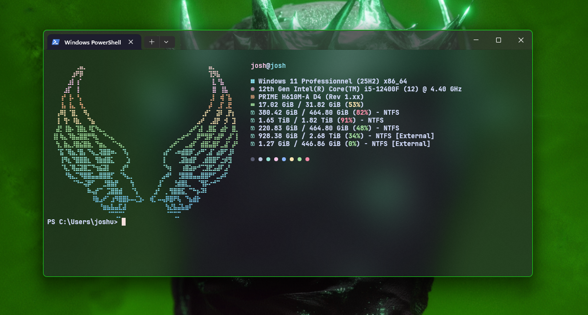

# Better CMD

Configuration automatique d’un terminal Windows stylé : **Windows Terminal** (thème Catppuccin Mocha, transparence, Nerd Font) + **Fastfetch** au démarrage de PowerShell.

Inspiré du tutoriel de [SleepyCatHey](https://www.youtube.com/) — ce dépôt regroupe tout en un seul script cliquable.

## Aperçu



## Ce que fait le script

En lançant `Better-CMD.bat`, le script :

| Étape | Action |
|--------|--------|
| **winget** | Vérifie la présence de `winget` ; l’installe via App Installer si besoin |
| **Fastfetch** | Installe [Fastfetch](https://github.com/fastfetch-cli/fastfetch) et copie la config (`fastfetch/`) vers `%USERPROFILE%\.config\fastfetch` |
| **Polices** | Installe **tous** les fichiers `.ttf` / `.otf` du dossier `fonts/` pour l’utilisateur courant (copie + registre + rafraîchissement du cache) |
| **Windows Terminal** | Déploie `LocalState/settings.json` (profils, couleurs, police JetBrainsMono Nerd Font Mono, acrylic, etc.) |
| **PowerShell** | Ajoute `fastfetch` au profil utilisateur pour l’afficher à chaque ouverture |
| **Relance** | Redémarre Windows Terminal pour appliquer les changements |

Les sauvegardes de l’ancien `settings.json` sont stockées dans :

`%USERPROFILE%\.better-cmd-backups\`

## Prérequis

- **Windows 10/11**
- **[Windows Terminal](https://aka.ms/terminal)** (Microsoft Store)
- Connexion Internet recommandée (installation de winget / Fastfetch)
- Droits **administrateur** au premier lancement (via l’élévation UAC de `Better-CMD.bat`)

## Installation

1. Clone ou télécharge ce dépôt.
2. Vérifie que le dossier `fonts/` contient tes polices (JetBrains Mono Nerd Font, etc.).
3. Double-clique sur **`Better-CMD.bat`** et accepte l’élévation UAC.
4. Attends la fin du script — Windows Terminal se rouvre avec la nouvelle config.

### Ligne de commande

```powershell
# Installation
.\Better-CMD.ps1

# Désinstallation (restaure settings.json + retire fastfetch du profil)
.\Better-CMD.ps1 -Uninstall
```

Ou utilise **`Better-CMD-Uninstall.bat`** pour la restauration sans passer par PowerShell manuellement.

> **Note :** la désinstallation ne supprime pas les polices ni Fastfetch du système — seulement la config Windows Terminal (depuis la sauvegarde) et l’entrée `fastfetch` dans le profil PowerShell.

## Structure du projet

```
Better-CMD/
├── Better-CMD.bat              # Lanceur (admin) — à utiliser en priorité
├── Better-CMD.ps1              # Script principal
├── Better-CMD-Uninstall.bat    # Restauration rapide
├── preview.png                 # Capture d’écran pour ce README
├── fonts/                      # Polices .ttf / .otf installées automatiquement
├── fastfetch/
│   ├── config.jsonc            # Config Fastfetch (thème Catppuccin)
│   └── ascii.txt               # Logo ASCII affiché à gauche
└── LocalState/
    └── settings.json           # Profils et apparence Windows Terminal
```

## Personnalisation

- **Terminal** : modifie `LocalState/settings.json`, puis relance `Better-CMD.bat`.
- **Fastfetch** : édite `fastfetch/config.jsonc` ou remplace `fastfetch/ascii.txt`.
- **Polices** : ajoute ou retire des fichiers dans `fonts/`, puis relance le script — seules les nouvelles polices seront copiées.

Police par défaut dans Windows Terminal : **JetBrainsMono Nerd Font Mono**.

## Dépannage

| Problème | Piste |
|----------|--------|
| `winget` introuvable | Relance `Better-CMD.bat` après installation d’App Installer, ou installe [App Installer](https://apps.microsoft.com/detail/9nblggh4nns1) |
| Icônes cassées dans Fastfetch | Vérifie que les polices Nerd Font sont bien dans `fonts/` et que le script les a installées |
| Police absente dans le menu WT | Ferme complètement Windows Terminal, relance le script, ou redémarre la session |
| Restaurer l’ancien terminal | `Better-CMD-Uninstall.bat` |

## Crédits

- Tutoriel d’origine : **SleepyCatHey**
- [Fastfetch](https://github.com/fastfetch-cli/fastfetch)
- [JetBrains Mono Nerd Font](https://github.com/ryanoasis/nerd-fonts)
- Thème **Catppuccin Mocha**

## Licence

Projet fourni tel quel, sans garantie. Les polices et outils tiers restent soumis à leurs licences respectives.
